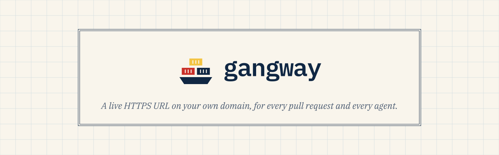

<p align="center">
  <picture>
    <source media="(prefers-color-scheme: dark)" srcset=".github/assets/header-dark.svg">
    
  </picture>
</p>

<p align="center">
  <a href="LICENSE">Apache-2.0</a> ·
  <a href="#quickstart">Quickstart</a> ·
  <a href="#connect-an-agent">Connect an agent</a> ·
  <a href="#pull-request-previews">Pull-request previews</a>
</p>

---

**gangway** gives any containerized app a public HTTPS URL on your own domain. You get a URL
in three ways, and all three produce the same kind of preview:

1. **A pull request** opens or updates. The preview is linked from a sticky comment and torn
   down when the PR closes.
2. **An agent** calls the MCP `deploy` tool. It works with Claude Code, Codex, Cursor, VS Code or
   any MCP client. The call blocks until the URL actually answers, then returns it.
3. **A person** deploys from the web UI or the REST API: drop in files, paste a Compose stack,
   or point at a git ref.

It runs as a single process on a plain Docker host, with no Kubernetes. You self-host it on
your own domain.

<!-- Screenshot: the Previews list and a preview's page. -->

## What you get

- **A URL per preview under one wildcard certificate**, such as
  `shop-pr-142.preview.example.com`. There is no per-preview certificate, so Let's Encrypt
  rate limits never bite.
- **Full Docker Compose stacks**, not just single containers. Several services, healthchecks
  and seed hooks all work, and each exposed service gets its own hostname.
- **No Dockerfile needed.** Static, Node, Bun, Deno, workerd, Python and PHP apps are detected
  from their files, and a `gangway.yml` can say more.
- **Throwaway databases.** Postgres, MySQL or Redis run beside the app, their URLs are handed
  to it as environment variables, and they are gone when the preview is. The preview page has
  a data browser.
- **Previews expire and sleep.** Each preview gets a time to live, idle ones go to sleep, and
  the first request wakes them.
- **Who can see a preview is up to you.** A preview can be public, unlisted (an unguessable
  hostname), password-protected, or visible only to people signed in to gangway.
- **Static sites and artifacts are served by gangway itself.** They need no container and
  deploy in milliseconds. One `artifact.md` renders as a document, a slide deck, a dashboard
  or a prototype.
- **Accounts and permissions.** Roles are made of per-feature permissions that you can remap.
  There are API tokens and OAuth for MCP clients, and an audit log.

## How it works

```
app.<domain>   ─┐
api.<domain>   ─┼─▶  UI · REST API · OAuth ─┐
mcp.<domain>   ─┤    MCP                    │
hooks.<domain> ─┘    GitHub webhooks        ├─▶ builder · scheduler · SQLite
                                            │          │
*.<domain>     ───▶  proxy: gate, wake ─────┘          ▼ Docker API
                          │                     Docker host(s)
                          └──────────────────▶  your preview's containers
```

gangway dispatches every request on its `Host` header. The reserved labels (`app`, `api`,
`mcp`, `hooks`) reach gangway itself, and every other label is a preview. It runs your stack
with `docker compose`, under a policy that refuses anything that would reach the host:
privileged mode, bind mounts, host networking, the Docker socket and the like. It also drops
Linux capabilities and applies memory and process limits. SQLite is the source of truth, and
every container carries labels that describe it, so a restart reconciles the two.

## Quickstart

> **Status: early.** gangway is v0.x and runs in production for its author. Expect rough edges,
> and read [Security](#security) before you expose it.

### You need

- A Linux host with Docker Engine and the Compose plugin.
- A domain you control, with a **wildcard DNS record** such as `*.preview.example.com` and
  `preview.example.com` pointing at that host.
- A **wildcard certificate** for it. gangway can get one itself over DNS-01 with a Cloudflare
  API token, or a reverse proxy in front can hold it.

### Run it

```sh
git clone https://github.com/charlesabarnes/gangway && cd gangway
cat > .env <<'EOF'
GANGWAY_ADMIN_TOKEN=gw_REPLACE_ME          # echo "gw_$(openssl rand -hex 24)"
GANGWAY_BASE_DOMAIN=preview.example.com
GANGWAY_INSTANCE=main                      # names this install's containers: gw-main-<slug>
GANGWAY_STATE_PATH=/srv/gangway            # SQLite, logs and uploads
EOF
docker compose up -d --build
docker compose logs gangway | grep setup   # the one-time link that creates the first admin
```

Open the setup link to create the first admin account. There are no default credentials. The
link changes on every start until the first account exists.

[`compose.yaml`](compose.yaml) documents every setting inline. It assumes a reverse proxy such
as Nginx Proxy Manager holds port 443 and the certificate. **To let gangway own 443 and get its
own certificate** instead, add:

```sh
GANGWAY_LISTEN_ADDRESS=::
GANGWAY_TLS_MODE=acme
GANGWAY_TRUSTED_PROXIES=
GANGWAY_CF_API_TOKEN=...                   # a Cloudflare token that can edit the zone's DNS
GANGWAY_ACME_DIRECTORY_URL=https://acme-v02.api.letsencrypt.org/directory
```

<!-- Walkthrough to verify on a clean VPS before v0.1.0: DNS, first certificate, setup link, first deploy. -->

### Deploy something

From the UI, go to **New preview** and drop in a folder. From a terminal:

```sh
tar -czf - . | curl --fail -X POST \
  -H "Authorization: Bearer $GANGWAY_TOKEN" -H "Content-Type: application/gzip" \
  --data-binary @- "https://api.preview.example.com/v1/previews?name=hello&wait=true"
```

The answer includes the URL once the preview serves it. Create tokens under **Account**.

## Connect an agent

Turn the MCP surface on under **Settings**; it is off by default. Your gangway's
**Account → Connect an agent** page then shows the exact setup for Claude Code, Codex, Cursor
and VS Code with your URL filled in. For Claude Code:

```sh
claude plugin marketplace add charlesabarnes/gangway && \
  claude plugin install gangway@gangway --config mcp_url=https://mcp.preview.example.com/
```

Then run `/mcp` and sign in. The plugin adds `/gangway:generate-artifact`, which builds
something and ships it to a URL you can keep iterating on. Other clients only need the MCP URL.
See [plugin/gangway](plugin/gangway/README.md).

The MCP server has four tools: `deploy`, `status`, `logs` and `destroy`. `deploy` is
idempotent, and it waits until the URL answers.

## Pull-request previews

1. Under **Settings → GitHub**, create a GitHub App in one click through GitHub's manifest
   flow, so no secret is copied by hand. Install it on your repositories.
2. Create a **Project** for a repository. By default the project gives you a workflow file to
   commit. It builds on GitHub Actions and hands gangway the image, authenticated by the run's
   OIDC token. The alternative is to have gangway build from webhooks.
3. Open a PR. The preview's URL arrives in a sticky comment and a GitHub Deployment. Pull
   requests from forks wait until a maintainer comments `/preview deploy`.

## Configuration

Everything can be set in the environment. Settings not pinned there are editable in the UI.

| Variable                                     | Default             |                                                                |
| -------------------------------------------- | ------------------- | -------------------------------------------------------------- |
| `GANGWAY_BASE_DOMAIN`                        | required            | Domain for the UI, API, MCP and, by default, previews          |
| `GANGWAY_PREVIEW_DOMAIN`                     | _(base domain)_     | Optional: put previews on their own registrable domain         |
| `GANGWAY_INSTANCE`                           | required            | Prefix for this install's containers, networks and volumes     |
| `GANGWAY_ADMIN_TOKEN`                        | _(none)_            | Break-glass admin token, the only one that can mint tokens     |
| `GANGWAY_TLS_MODE`                           | `selfsigned`        | `selfsigned`, `acme` (DNS-01) or `file`                        |
| `GANGWAY_TRUSTED_PROXIES`                    | _(none)_            | Proxies whose `X-Forwarded-For` is believed                    |
| `GANGWAY_CONTROL_ALLOW`                      | _(everyone)_        | Networks allowed to reach the UI and API; previews stay public |
| `GANGWAY_PREVIEW_MEMORY` / `_CPUS` / `_PIDS` | `2g` / off / `1024` | Limits for every preview container                             |
| `GANGWAY_SURFACE_MCP`                        | `false`             | Pin the MCP surface on or off                                  |

<!-- Expand from compose.yaml: listen ports, hosts, reconcile, ACME email, GitHub App vars. -->

## Security

- gangway talks to the Docker socket, which is **root on that host**. Give UI accounts and
  tokens only to people you would trust with a shell there, or keep the UI and API on your own
  network with `GANGWAY_CONTROL_ALLOW`.
- Preview code is treated as hostile.
  - The Compose policy refuses host namespaces, bind mounts, devices, added capabilities,
    external networks and volumes, and other previews' images.
  - Every container runs with `no-new-privileges`, a reduced set of capabilities, and memory
    and process limits.
  - Secrets never reach a build context.
- **Previews can reach the internet and your LAN.** If that matters, firewall the preview
  networks (Docker's `DOCKER-USER` chain), or give gangway a Docker host of its own.
- Previews share a site with the UI unless you set `GANGWAY_PREVIEW_DOMAIN`. The session
  cookie is host-only and CSRF is checked by `Origin`, but a separate preview domain is the
  stronger setup for untrusted pull requests.

Report vulnerabilities privately through GitHub's **Security → Report a vulnerability**, not in
an issue.

## Known limits

- There is no cap on concurrent builds; builds share the host with everything else.
- Static previews served by gangway do not answer HTTP Range requests.
- A preview's logs are removed with the preview.
- GitHub is the only forge.

## Development

```sh
bun install
bun run test         # server, shared and render; no Docker needed
bun run typecheck && bun run lint
cp scripts/dev.example.json scripts/dev.json   # then point it at your Docker host
GANGWAY_CONFIG=scripts/dev.json bun run dev
cd web && npm install && npm start   # the Angular UI
```

The server is TypeScript on [Bun](https://bun.sh), [Hono](https://hono.dev) and
`bun:sqlite`. The UI is Angular with Tailwind. Every dependency is free of native addons.

## License

[Apache-2.0](LICENSE)
