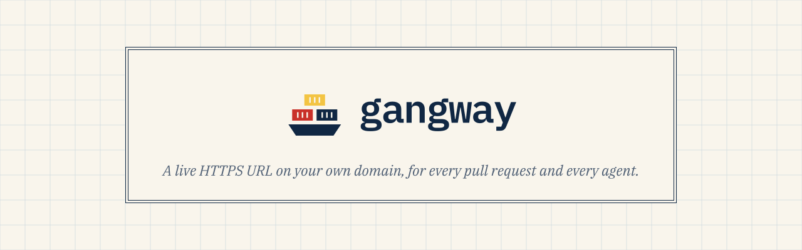
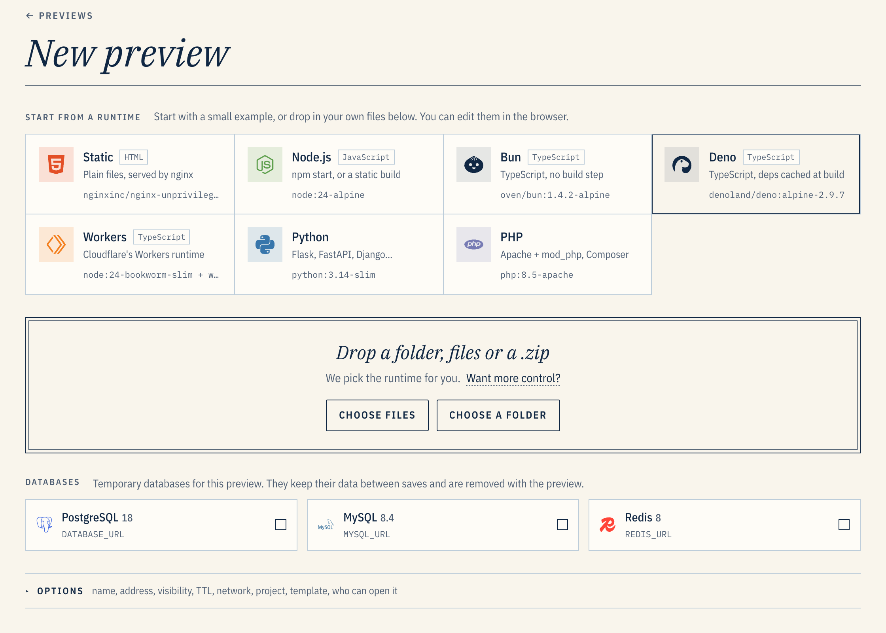
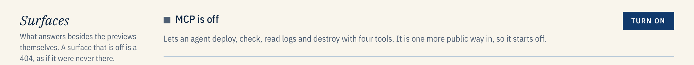
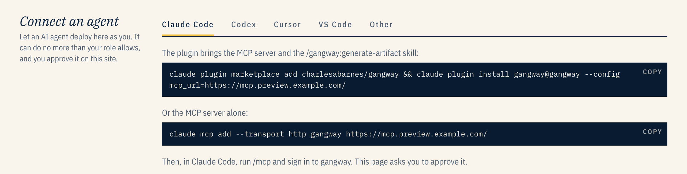
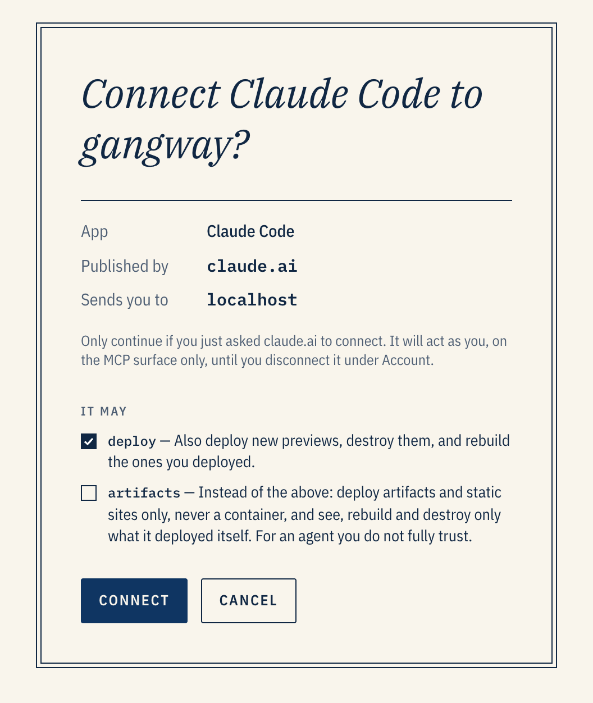

<p align="center">
  <picture>
    <source media="(prefers-color-scheme: dark)" srcset=".github/assets/header-dark.svg">
    
  </picture>
</p>

<p align="center">
  <a href="LICENSE">Apache-2.0</a> ·
  <a href="#quickstart">Quickstart</a> ·
  <a href="#connect-an-agent">Connect an agent</a> ·
  <a href="#pull-request-previews">Pull-request previews</a>
</p>

---

**[gangway](https://gangway.sh)** gives any containerized app a public HTTPS URL on your own domain.

Hosted platforms will put your app on a URL, but on their servers, for the frameworks they
support, at their prices. I had a server with room to spare and kept needing a link for
something: a visual review for a frontend pull request, a build for a client, a deck an agent
had just made. gangway is the one place, on hardware you already own, that turns any of those
into a URL in seconds.

You get a URL in three ways, and all three produce the same kind of preview:

1. **A pull request** opens or updates. The preview is linked from a sticky comment and torn
   down when the PR closes.
2. **An agent** calls the MCP `deploy` tool. It works with Claude Code, Codex, Cursor, VS Code or
   any MCP client. The call blocks until the URL actually answers, then returns it.
3. **A person** deploys from the web UI or the REST API: drop in files, paste a Compose stack,
   or point at a git ref.

It runs as a single process on a plain Docker host, with no Kubernetes. You self-host it on
your own domain.

https://github.com/user-attachments/assets/f53178ca-89fc-4ecf-b6b7-bf7490b57ac2

## What you get

- **A URL per preview under one wildcard certificate**, such as
  `shop-pr-142.preview.example.com`. There is no per-preview certificate, so Let's Encrypt
  rate limits never bite.
- **Full Docker Compose stacks**, not just single containers. Several services, healthchecks
  and seed hooks all work, and each exposed service gets its own hostname.
- **No Dockerfile needed.** Static, Node, Bun, Deno, workerd, Python and PHP apps are detected
  from their files, and a `gangway.yml` can say more.
- **Throwaway databases.** Postgres, MySQL or Redis run beside the app, their URLs are handed
  to it as environment variables, and they are gone when the preview is. The preview page has
  a data browser.
- **Previews expire and sleep.** Each preview gets a time to live, idle ones go to sleep, and
  the first request wakes them.
- **Who can see a preview is up to you.** A preview can be public, unlisted (an unguessable
  hostname), password-protected, or visible only to people signed in to gangway.
- **Static sites and artifacts are served by gangway itself.** They need no container and
  deploy in milliseconds. One `artifact.md` renders as a document, a slide deck, a dashboard
  or a prototype.
- **Accounts and permissions.** Roles are made of per-feature permissions that you can remap.
  There are API tokens and OAuth for MCP clients, and an audit log.

## How it works

```
app.<domain>   ─┐
api.<domain>   ─┼─▶  UI · REST API · OAuth ─┐
mcp.<domain>   ─┤    MCP                    │
hooks.<domain> ─┘    GitHub webhooks        ├─▶ builder · scheduler · SQLite
                                            │          │
*.<domain>     ───▶  proxy: gate, wake ─────┘          ▼ Docker API
                          │                     Docker host(s)
                          └──────────────────▶  your preview's containers
```

gangway dispatches every request on its `Host` header. The reserved labels (`app`, `api`,
`mcp`, `hooks`) reach gangway itself, and every other label is a preview. It runs your stack
with `docker compose`, under a policy that refuses anything that would reach the host:
privileged mode, bind mounts, host networking, the Docker socket and the like. It also drops
Linux capabilities and applies memory and process limits. SQLite is the source of truth, and
every container carries labels that describe it, so a restart reconciles the two.

## Quickstart

> **Status: early.** gangway is v0.x and runs in production for its author. Expect rough edges,
> and read [Security](#security) before you expose it.

### You need

- Docker (Engine, Desktop or Colima) or Podman, with Compose.

To serve previews publicly, also:

- A server other people can reach, on 443 or any port you choose (`GANGWAY_PUBLIC_PORT`
  puts it in the URLs gangway hands out).
- A domain you control, with a **wildcard DNS record** such as `*.preview.example.com` and
  `preview.example.com` pointing at that server.
- A **wildcard certificate** for it. gangway can get one itself over DNS-01 with a Cloudflare
  API token, or a reverse proxy in front can hold it.

Or run it **local-only**, with none of that: `--local` puts the dashboard, API, MCP and previews
on `*.preview.localhost`, which answers only on the machine gangway runs on. It is the default
on a laptop. To show a preview to anyone else, press **Share** on its page (or ask your agent to
share it): gangway opens a [Cloudflare quick tunnel](https://developers.cloudflare.com/tunnel/get-started/#quick-tunnels-development)
and hands back a public `https://….trycloudflare.com` link, until you stop it or it expires.
Quick tunnels need no Cloudflare account and are meant for testing: at most 200 requests at
once, no server-sent events, and a new link each time. Sharing is on by default only for a
local-only install; on a domain install an admin turns it on in Admin, or with `GANGWAY_SHARE=true`.

### Run it

On the host, as root or a user in the `docker` group:

```sh
curl -fsSL gangway.sh/install | sh
```

The installer asks where gangway answers: on your domain behind a reverse proxy (the default),
on your domain with gangway holding port 443, or with no domain (`--lan` or `--local`). For a
domain it asks for the domain, and when gangway holds port 443, for a Cloudflare API token so
it can get a Let's Encrypt wildcard certificate over DNS-01. It checks Docker, DNS and the ports, writes
`/opt/gangway/.env` (with a generated admin token) and `compose.yaml`, starts gangway, and
prints a one-time link.

Open that link to create the first admin account. There are no default credentials. The link
changes on every start until the first account exists; `docker logs gangway | grep setup`
shows the current one.

It installs the way the host expects. On plain Linux that is a compose project. CasaOS (a
compose project that shows up as an app), Unraid (a Docker-tab template with the icon), TrueNAS
SCALE (a custom app), Synology and desktop engines (Docker Desktop, Colima, Podman, on
`preview.localhost`) are supported but **experimental**: written to each platform's
conventions, not yet verified on one.

Run the installer again to upgrade. gangway backs its database up before it migrates, and if
the new version does not come up healthy the installer puts the previous version and that
backup back; `--rollback` does the same by hand. Changes of your own to the compose setup go in
`compose.override.yaml`, which upgrades leave alone. `--help` lists flags for everything it asks, so it can run
unattended: `curl -fsSL gangway.sh/install | sh -s -- --domain preview.example.com --tls acme --cf-token ... --yes`.

To try it from other machines on your network with no domain, use `--lan`: the dashboard is at
`https://app.<host-ip>.sslip.io:8443` ([sslip.io](https://sslip.io) answers any name with the IP
in it), browsers warn once about gangway's own certificate, and **Share** makes a preview public.

#### In a VM, or on Unraid

gangway holds the Docker socket, which is root on its host. To keep previews off a machine that
does other work, give gangway a VM: [`vm/cloud-init.yaml`](vm/cloud-init.yaml) turns a stock
Debian or Ubuntu cloud image into one on its first boot, in any hypervisor.

On Unraid, **gangway-inabox** does that for you, like Home Assistant in a Box: it creates the
VM, installs gangway in it, and shows the address and the first-admin link on its WebUI. The
plain **gangway** template runs it on Unraid's own Docker instead. Both are in
[`unraid/`](unraid/README.md).

#### By hand

[`compose.yaml`](compose.yaml) documents every setting inline. Next to it, write a `.env`:

```sh
GANGWAY_ADMIN_TOKEN=gw_REPLACE_ME          # echo "gw_$(openssl rand -hex 24)"
GANGWAY_BASE_DOMAIN=preview.example.com
GANGWAY_STATE_PATH=/srv/gangway            # SQLite, logs and uploads
```

then `docker compose up -d`. That assumes a reverse proxy such as Nginx Proxy Manager holds
port 443 and the certificate. **To let gangway own 443 and get its own certificate** instead,
add:

```sh
GANGWAY_LISTEN_ADDRESS=::
GANGWAY_LISTEN_PORT=443
GANGWAY_LISTEN_HTTP_PORT=80
GANGWAY_TLS_MODE=acme
GANGWAY_TRUSTED_PROXIES=
GANGWAY_CF_API_TOKEN=...                   # a Cloudflare token that can edit the zone's DNS
GANGWAY_ACME_DIRECTORY_URL=https://acme-v02.api.letsencrypt.org/directory
```

To build from a checkout instead of pulling the published image:
`docker compose -f compose.yaml -f compose.build.yaml up -d --build`.

<!-- Walkthrough to verify on a clean VPS before v0.1.0: DNS, first certificate, setup link, first deploy. -->

### Deploy something

From the UI, go to **New preview** and drop in a folder. You can also start from a runtime's
example, or add a throwaway database.

<picture>
  <source media="(prefers-color-scheme: dark)" srcset=".github/assets/screenshots/new-dark.png">
  
</picture>

From a terminal:

```sh
tar -czf - . | curl --fail -X POST \
  -H "Authorization: Bearer $GANGWAY_TOKEN" -H "Content-Type: application/gzip" \
  --data-binary @- "https://api.preview.example.com/v1/previews?name=hello&runtime=auto&wait=true"
```

The answer includes the URL once the preview serves it. Create tokens under **Account**.

## Connect an agent

**1. Turn on MCP.** It is off by default. Under **Admin → Server → Surfaces**, choose **Turn on**.

<picture>
  <source media="(prefers-color-scheme: dark)" srcset=".github/assets/screenshots/mcp-off-dark.png">
  
</picture>

**2. Copy the setup for your client.** **Account → Connect an agent** shows the exact commands
for Claude Code, Codex, Cursor and VS Code, with your URL filled in.

<picture>
  <source media="(prefers-color-scheme: dark)" srcset=".github/assets/screenshots/connect-agent-dark.png">
  
</picture>

For Claude Code:

```sh
claude plugin marketplace add charlesabarnes/gangway && \
  claude plugin install gangway@gangway --config mcp_url=https://mcp.preview.example.com/
```

**3. Sign in and approve.** In Claude Code, run `/mcp` and sign in to gangway. Your browser
opens gangway, which asks you to approve the agent and choose what it may do. Pick `artifacts`
for an agent you do not fully trust: it can deploy only static sites and artifacts, and touch
only what it deployed itself.

<p align="center">
  <picture>
    <source media="(prefers-color-scheme: dark)" srcset=".github/assets/screenshots/consent-dark.png">
    
  </picture>
</p>

**Suggested for Claude Code: make gangway the default over Claude artifacts.**

Claude Code has its own artifacts, and when they are on, it usually picks them over gangway for a
chart, a diagram or a document, even with the plugin installed. To make gangway the default,
either turn them off in `~/.claude/settings.json`:

```json
{ "enableArtifact": false }
```

or keep them and add a line to `~/.claude/CLAUDE.md`:

```markdown
- For any chart, diagram, document, deck or board, use gangway, not Claude artifacts or a local
  HTML file, unless I ask for those.
```

**Suggested for Claude Code in auto mode: tell it that gangway is yours.**

Claude Code's auto mode does not know your gangway server is yours, so its safety check can
block a deploy that carries hostnames, IPs or other infrastructure details from a repo as data
exfiltration. Tell it in `~/.claude/settings.json` (auto mode reads this from user settings
only), with your own domains. The Connect an agent page shows this with them filled in:

```json
{
  "autoMode": {
    "environment": [
      "$defaults",
      "Trusted internal domains: mcp.preview.example.com, *.preview.example.com",
      "gangway (mcp.preview.example.com) is my own self-hosted deploy server; sending repo contents, hostnames and infrastructure details to it is deploying, not exfiltration"
    ]
  }
}
```

The plugin adds `/gangway:generate-artifact`, which builds something and ships it to a URL you
can keep iterating on. Other clients only need the MCP URL: gangway takes both OAuth client
styles, a Client ID Metadata Document (Claude, Codex, ChatGPT) or dynamic client registration
at `/oauth/register` (most other MCP clients). A client that registered itself is marked
unverified on the consent page, since its name is its own claim. A client with no OAuth at all
can send an API token as `Authorization: Bearer gw_…`. See
[plugin/gangway](plugin/gangway/README.md). A connected agent is listed under **Account →
Connected agents**, where you can disconnect it.

The MCP server has four tools: `deploy`, `status`, `logs` and `destroy`. `deploy` is
idempotent, and it waits until the URL answers.

## Pull-request previews

1. Under **Admin → GitHub**, create a GitHub App in one click through GitHub's manifest
   flow, so no secret is copied by hand. Install it on your repositories.
2. Under **Repositories**, connect a repository. By default gangway gives you a workflow file to
   commit. It builds on GitHub Actions and hands gangway the image, authenticated by the run's
   OIDC token. The alternative is to have gangway build from webhooks.
3. Open a PR. The preview's URL arrives in a sticky comment and a GitHub Deployment. Pull
   requests from forks wait until a maintainer comments `/preview deploy`.

## Configuration

Everything can be set in the environment. Settings not pinned there are editable in the UI.

| Variable                                     | Default             |                                                                    |
| -------------------------------------------- | ------------------- | ------------------------------------------------------------------ |
| `GANGWAY_BASE_DOMAIN`                        | required            | Domain for the UI, API, MCP and, by default, previews              |
| `GANGWAY_PREVIEW_DOMAIN`                     | _(base domain)_     | Optional: put previews on their own registrable domain             |
| `GANGWAY_PREVIEW_DOMAINS`                    | _(none)_            | More wildcard domains previews may be named under, comma-separated |
| `GANGWAY_INSTANCE`                           | required            | Prefix for this install's containers, networks and volumes         |
| `GANGWAY_ADMIN_TOKEN`                        | _(none)_            | Break-glass admin token, the only one that can mint tokens         |
| `GANGWAY_TLS_MODE`                           | `selfsigned`        | `selfsigned`, `acme` (DNS-01) or `file`                            |
| `GANGWAY_TRUSTED_PROXIES`                    | _(none)_            | Proxies whose `X-Forwarded-For` is believed                        |
| `GANGWAY_CONTROL_ALLOW`                      | _(everyone)_        | Networks allowed to reach the UI and API; previews stay public     |
| `GANGWAY_PREVIEW_MEMORY` / `_CPUS` / `_PIDS` | `1g` / off / `1024` | Limits for every preview container                                 |
| `GANGWAY_SURFACE_MCP`                        | `false`             | Pin the MCP surface on or off                                      |
| `GANGWAY_SHARE`                              | on if local-only    | Pin share links on or off; while off, cloudflared never starts     |
| `GANGWAY_CLOUDFLARED`                        | `cloudflared`       | The cloudflared binary share links run; the image carries one      |

<!-- Expand from compose.yaml: listen ports, hosts, reconcile, ACME email, GitHub App vars. -->

### Domains

Previews are named `<label>.<domain>`. Beyond the domains in the environment, anyone with the
permission can claim one they own, in Admin → Domains & traffic (for every repository), on a repository's
Domains tab (its previews, or a hostname for its production preview), or on a preview (a
hostname such as `www.example.com`). A claim asks for two DNS records at the owner's provider:

- `_acme-challenge.<name>` as a CNAME to the `<id>.acme.<your base domain>` name gangway shows.
  It proves the name is theirs, and gangway answers the certificate challenge there.
- `*.<name>` (or the hostname) as a CNAME to your base domain, which sends the traffic here.

gangway checks every minute. With `GANGWAY_TLS_MODE=acme` and a Cloudflare token for the base
domain's zone, it then gets a certificate for the name and serves it by SNI, one certificate per
domain. A repository or preview chooses its domain from those it may use; a preview moves when
it is next deployed or rebuilt.

Behind a reverse proxy the proxy holds the certificates. Caddy can get one per name on demand:

```caddyfile
{
  on_demand_tls {
    ask http://gangway:8080/_gangway/tls/ask
  }
}
https:// {
  tls {
    on_demand
  }
  reverse_proxy https://gangway:8443 {
    transport http {
      tls_insecure_skip_verify
    }
  }
}
```

The ask is on gangway's plain-HTTP listener (`GANGWAY_LISTEN_HTTP_PORT`, 8080 unless set empty).
gangway answers it only from loopback or `GANGWAY_TRUSTED_PROXIES`, and only for names it
serves today. Nginx Proxy Manager needs a proxy host and certificate per domain, added by hand.

Preview traffic is rate limited per visitor and per preview (Admin → Domains & traffic); past
the limit a preview answers 429.

## Security

- gangway talks to the Docker socket, which is **root on that host**. Give UI accounts and
  tokens only to people you would trust with a shell there, or keep the UI and API on your own
  network with `GANGWAY_CONTROL_ALLOW`.
- Preview code is treated as hostile.
  - The Compose policy refuses host namespaces, bind mounts, devices, added capabilities,
    external networks and volumes, and other previews' images.
  - Every container runs with `no-new-privileges`, a reduced set of capabilities, and memory
    and process limits.
  - Secrets never reach a build context.
- **Previews can reach the internet and your LAN.** If that matters, firewall the preview
  networks (Docker's `DOCKER-USER` chain), or give gangway a Docker host of its own.
- Previews share a site with the UI unless you set `GANGWAY_PREVIEW_DOMAIN`. The session
  cookie is host-only and CSRF is checked by `Origin`, but a separate preview domain is the
  stronger setup for untrusted pull requests.

Report vulnerabilities privately through GitHub's **Security → Report a vulnerability**, or by
email to security@gangway.sh, not in an issue.

## Known limits

- There is no cap on concurrent builds; builds share the host with everything else.
- gangway speaks HTTP/1.1. It sends its assets precompressed (brotli or gzip), but a reverse
  proxy in front (Caddy, Nginx Proxy Manager) gives browsers HTTP/2, which loads the UI's many
  small files faster.
- Static previews served by gangway answer a single byte range, not several at once.
- A preview's logs are removed with the preview.
- GitHub is the only forge.

## Development

```sh
bun install
bun run test         # server, shared and render; no Docker needed
bun run typecheck && bun run lint
cp scripts/dev.example.json scripts/dev.json   # then point it at your Docker host
GANGWAY_CONFIG=scripts/dev.json bun run dev
cd web && npm install && npm start   # the Angular UI
```

The server is TypeScript on [Bun](https://bun.sh), [Hono](https://hono.dev) and
`bun:sqlite`. The UI is Angular with Tailwind. Every dependency is free of native addons.

## License

[Apache-2.0](LICENSE)
